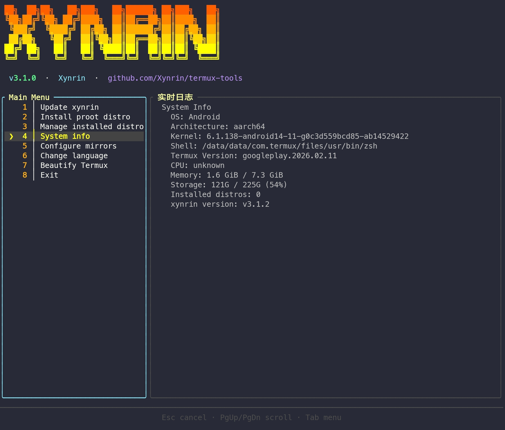

<div align="center">

# 

**A TUI helper tool for Termux beginners**

[](LICENSE)
[](scripts/version)
[](https://termux.dev)

[中文 README](README.zh.md) · [Issues](https://github.com/Xynrin/termux-tools/issues) · [Changelog](CHANGELOG.md)

</div>

> **v3.1.0**: streaming-log TUI with split panels, semantic color levels, and live scrolling. Offline `CHANGELOG.md` rendered inside the TUI on every update — **zero GitHub API calls**. proot manage now supports delete; beautify adds zsh / fish prompt setups.
>
> **v3.0.0**: TUI rewritten in **Rust + ratatui**, bash kept as fallback engine.

## One-line install

```bash
curl -sL https://raw.githubusercontent.com/Xynrin/termux-tools/main/bootstrap.sh | bash
```

The bootstrap installs the minimum (curl + git), clones the repo, and hands off to the Rust TUI which streams every remaining setup step (pkg upgrade, fzf/proot-distro, default Ubuntu container, aliases) inside a live log panel.

## Look it



## Manual install

```bash
git clone https://github.com/Xynrin/termux-tools.git ~/termux-tools
cd ~/termux-tools
bash install.sh
```

## CLI

```bash
xynrin                          # main TUI
xynrin update                   # check + show changelog + confirm + upgrade
xynrin update --show-notes      # show this version's changelog (offline)
xynrin sysinfo                  # plain-text system info
xynrin --bootstrap              # first-time TUI setup flow
xynrin help / version
xynrin-bash                     # always the bash fallback engine
```

## TUI menu

|  #  | Action                                         |
| :-: | ---------------------------------------------- |
|  1  | Update xynrin                                  |
|  2  | Install proot distro                           |
|  3  | System info (self-rendered, no fastfetch dep)  |
|  4  | Configure mirror sources                       |
|  5  | Change language                                |
|  6  | Beautify Termux (theme + bash/zsh/fish prompt) |
|  7  | Exit                                           |

Keys: `↑/↓` or `j/k` to select · `1..7` jump · `Enter` run · `Tab` focus log/menu · `PgUp/PgDn` scroll log · `Esc` cancel running action · `q` quit.

## Architecture

```
┌─────────────────────────┐
│  xynrin  (Rust TUI)     │  ← preferred, native binary, ratatui split-pane
└───────────┬─────────────┘
            │ spawns + captures stdout/stderr via ::level:: protocol
            ▼
┌─────────────────────────┐
│  xynrin-bash → modules/ │  ← bash engine; one module per feature
└─────────────────────────┘
```

Every action runs as `xynrin-bash --menu-<name>`. Each line prefixed `::step::`, `::ok::`, `::warn::`, `::err::`, `::info::` is colorized in the log panel; everything else is best-effort fuzzy matched.

## Offline release notes

`CHANGELOG.md` is `include_str!`'d into the Rust binary at compile time. `xynrin update` shows the current version's notes before pulling, and `xynrin update --show-notes` displays them after the upgrade exec. **No HTTP client, no `api.github.com`, no rate-limit risk.**

`scripts/release.sh` (and the GitHub Actions workflow) extract the same `## [X.Y.Z]` section via `scripts/extract-changelog.sh` and publish it as the GitHub Release body via `gh` CLI.

## Project structure

```
termux-tools/
├── CHANGELOG.md
├── bootstrap.sh
├── install.sh
├── tui/
│   ├── xynrin                 (thin dispatcher)
│   ├── lang/{zh,en}.sh
│   └── modules/{update,proot,sysinfo,mirror,beautify,language,bootstrap,_common}.sh
├── xynrin-tui/                (Rust + ratatui, no HTTP deps)
│   ├── Cargo.toml
│   └── src/{main,app,i18n,changelog,log_event,runner}.rs + ui/{mod,banner,menu,log_panel,notes_panel,footer}.rs
├── scripts/
│   ├── version
│   ├── extract-changelog.sh
│   └── release.sh
└── .github/workflows/release.yml
```

## License

[GPL-v3](LICENSE) · Author: **Xynrin**
